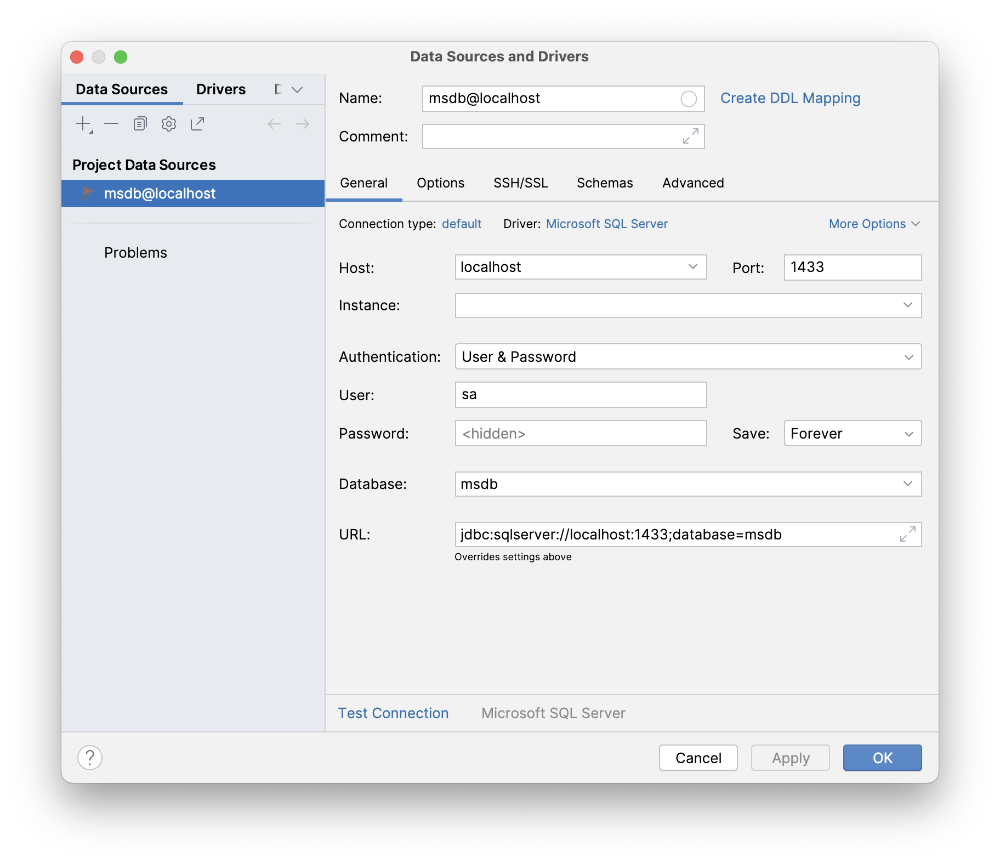

# 数据库

Download [Docker](https://www.docker.com/products/docker-desktop/) and run the following command. This will use the Linux [image](https://hub.docker.com/_/microsoft-mssql-server) of SQL Server 2017.

```zsh
docker run -e "ACCEPT_EULA=Y" -e "MSSQL_SA_PASSWORD=Password123" -e "MSSQL_PID=Express" -p 1433:1433 -d mcr.microsoft.com/mssql/server:2017-latest
```

When executing this command, the docker image will be pulled (downloaded) and executed. After running this command once, you don't have to use the Terminal again, instead you can use the Docker Desktop app to start and stop the container.

To connect to the database, you can use something like [Jetbrains DataGrid](https://www.jetbrains.com/datagrip/). The connection settings are as follows:


